# Introduction to the ArcGIS Location Services Postman Workspace 

<!-- START doctoc generated TOC please keep comment here to allow auto update -->
<!-- DON'T EDIT THIS SECTION, INSTEAD RE-RUN doctoc TO UPDATE -->
**Table of Contents** 

- [Workspace landing page](#workspace-landing-page)
- [Environment variables](#environment-variables)
  - [Local environment](#local-environment)
  - [Global environment](#global-environment)
  - [How variables are used](#how-variables-are-used)
- [Folder structure](#folder-structure)
  - [Collection structure](#collection-structure)
  - [Operation folder structure](#operation-folder-structure)
    - [Spec request template](#spec-request-template)
    - [Examples folder](#examples-folder)
    - [Response visualization (BETA)](#response-visualization-beta)
  - [Structures and definitions folder](#structures-and-definitions-folder)

<!-- END doctoc generated TOC please keep comment here to allow auto update -->

## Workspace landing page

It includes info to help developers using the Postman collections:

* Steps to get started
* Link to documentation guides
* API error codes
* Reference documentation
* Community & feedback

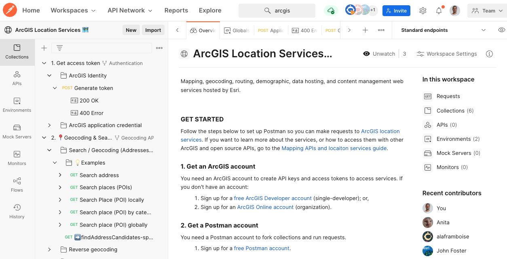
View: [ArcGIS Location Services 🗺️ - Postman workspace](https://www.postman.com/arcgis-developer/workspace/67f6e6f1-326f-4c0e-bcb9-b07c7a343257/overview)

## Environment variables
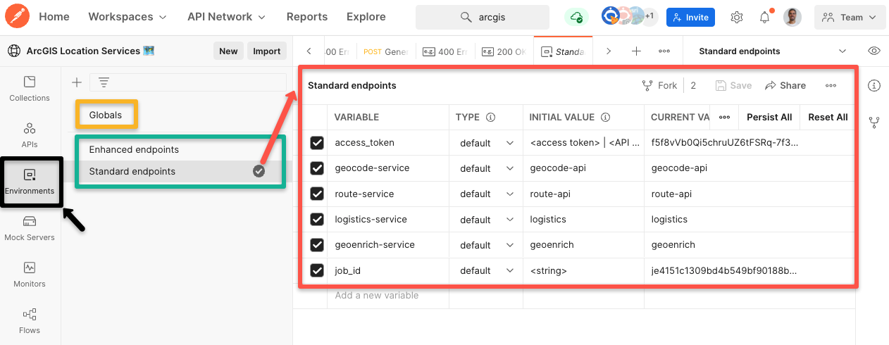
View: [Environments > Standard endpoints](https://www.postman.com/arcgis-developer/workspace/67f6e6f1-326f-4c0e-bcb9-b07c7a343257/environment/15786767-38d606e8-f269-44a4-8934-a53c251f4879)

### Local environment

There are two sets of **local environment variables** (green box) which includes:
* Set of endpoints for ready-to-use services.
* Temporal variables used in workflows (like job_id for async operations).
* For Enterprise users we recommend to create a custom environment.

### Global environment

The Global set ("**Globals**"; yellow box) is used to set credential to generate short-lived access tokens: user and pass, client_id and secret.

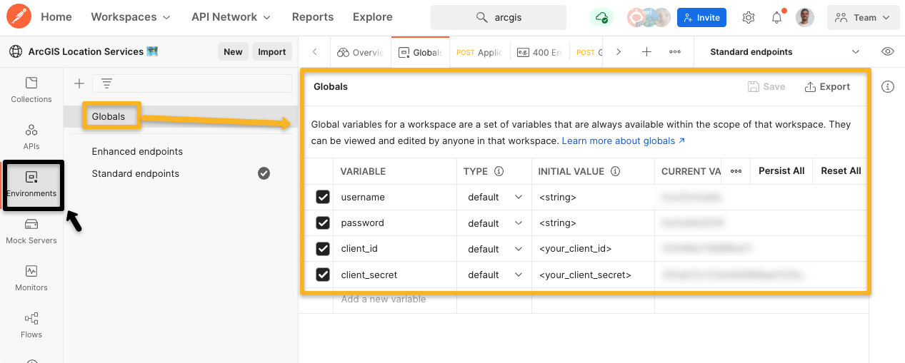

### How variables are used

Local and Global variables are used in the requests definitions using `{{variable name}}`:
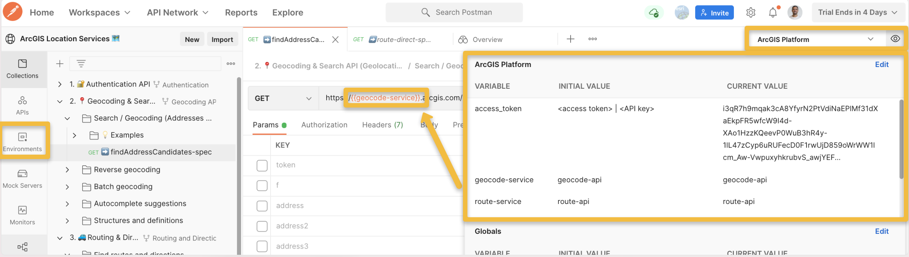
View: [2. 📍 Geocoding & Search API (Geolocation) > Search / Geocoding (Addresses & Places) > 💡 Examples > Search address](https://www.postman.com/arcgis-developer/workspace/67f6e6f1-326f-4c0e-bcb9-b07c7a343257/request/15786767-3c13e739-ad89-496d-9ddd-7746b2335dd0)

## Folder structure

There is a **Collection** (root folder) per each service:

* 1. 🔒  [Get access token](https://www.postman.com/arcgis-developer/workspace/67f6e6f1-326f-4c0e-bcb9-b07c7a343257/collection/15786767-75e3e16c-dd5a-4052-ae8d-2c9682055e8d)
* 2. 📍 [Geocoding & Search API (Geolocation)](https://www.postman.com/arcgis-developer/workspace/67f6e6f1-326f-4c0e-bcb9-b07c7a343257/collection/15786767-53db91ae-9385-4134-9070-1900cd2ea7d5?ctx=documentation)
* 3. 🚙 [Routing & Directions API](https://www.postman.com/arcgis-developer/workspace/67f6e6f1-326f-4c0e-bcb9-b07c7a343257/collection/15786767-43590e06-a693-4e7d-8048-60e4f0459ce9)
* 4. 🧑‍🤝‍🧑 [Demographics & GeoEnrichment API](https://www.postman.com/arcgis-developer/workspace/67f6e6f1-326f-4c0e-bcb9-b07c7a343257/collection/15786767-75ab5421-05a6-405a-8a78-47c3051525b8?ctx=documentation)
* 5. ☁️ [Data hosting](https://www.postman.com/arcgis-developer/workspace/67f6e6f1-326f-4c0e-bcb9-b07c7a343257/collection/18368309-b09b184c-3f9e-46c1-af7d-f976fb3a8b33?ctx=documentation)
* 6. 📁 [Content management](https://www.postman.com/arcgis-developer/workspace/67f6e6f1-326f-4c0e-bcb9-b07c7a343257/collection/18368309-e1811a9d-8e7d-4235-8939-c5a7b66b77f7?ctx=documentation)
* ... (it will evolve in the future)

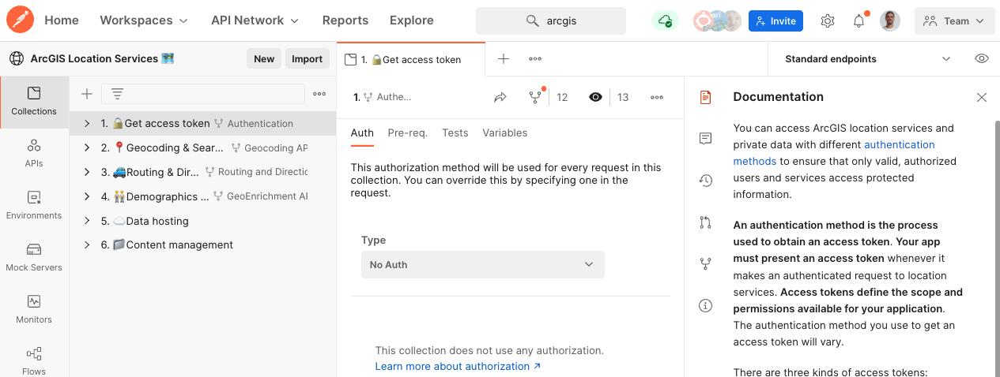
View: [1. 🔒 Get access token](https://www.postman.com/arcgis-developer/workspace/67f6e6f1-326f-4c0e-bcb9-b07c7a343257/collection/15786767-75e3e16c-dd5a-4052-ae8d-2c9682055e8d?ctx=documentation)

### Collection structure

Each collection include documentation related with the service (service specs, APIs availables, etc)
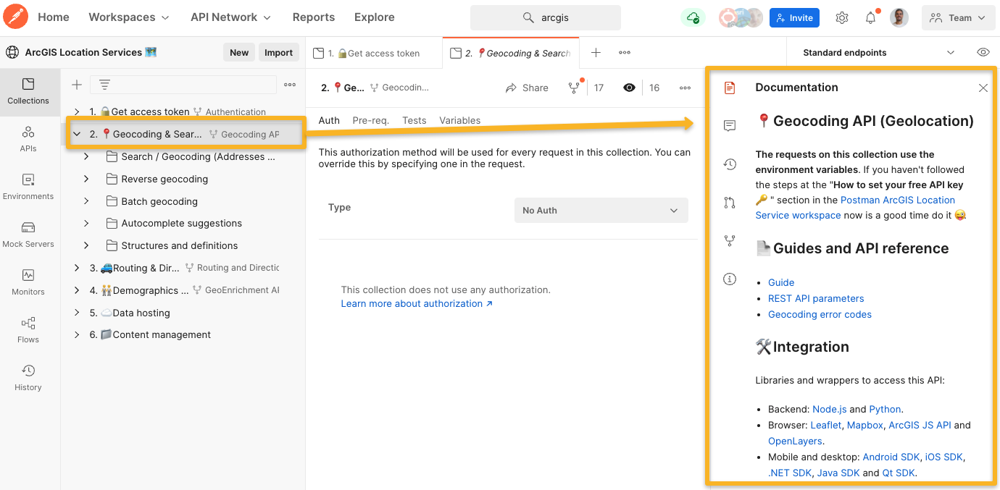

And it also contains:

* **A folder for each operation** supported by the service (e.g. in Geocoding & Search: direct geocoding, reserve geocoding, batch geocoding, etc.).

* **A folder** with requests **to query service metadata, field structures, etc**.
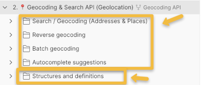
View: [2. 📍 Geocoding & Search API (Geolocation)](https://www.postman.com/arcgis-developer/workspace/arcgis-location-services/collection/15786767-53db91ae-9385-4134-9070-1900cd2ea7d5?ctx=documentation)

### Operation folder structure

We are going to illustrate the structure using the "Find routes and directions" operation within the "**🚙 Routing & Directions API**" as an example:
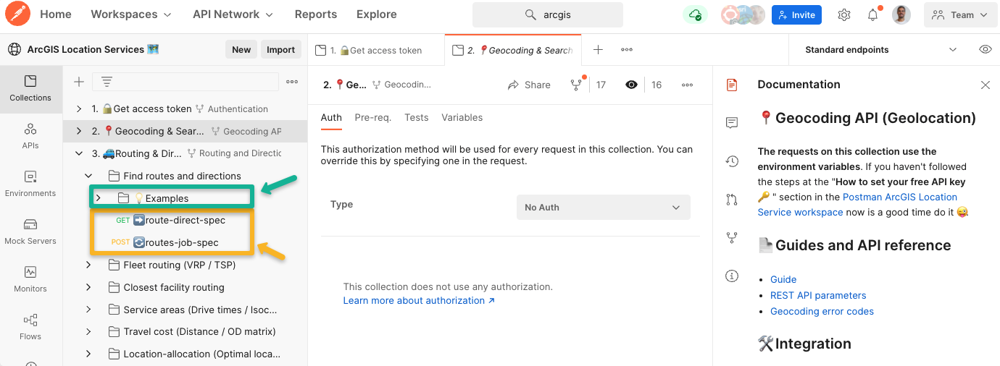

This and other operations includes:

* **One or two "spec requests template**" with all the parameters described in the specification (`*-spec`). There will be one or two depending on whether the operation supports a direct/sync (➡️) and a job/async (🔄) request or not. 

* A **"Examples"** folder with sample requests that matches the examples in the [Mapping APIs and locations services guides](https://developers.arcgis.com/documentation/mapping-apis-and-services/).

#### Spec request template

Each request in turn ( `operationName-spec`) includes:

* A short description, an image, and a link to the REST API doc and related guides in the developer guides.
* All accepted parameters (disabled by default), each with:
  * A short description (coming from the API reference). 
  * The value types that the operation support, using the value `<FieldName>` to referrers that it is a special JSON object with a given structure (more info in the REST API doc).

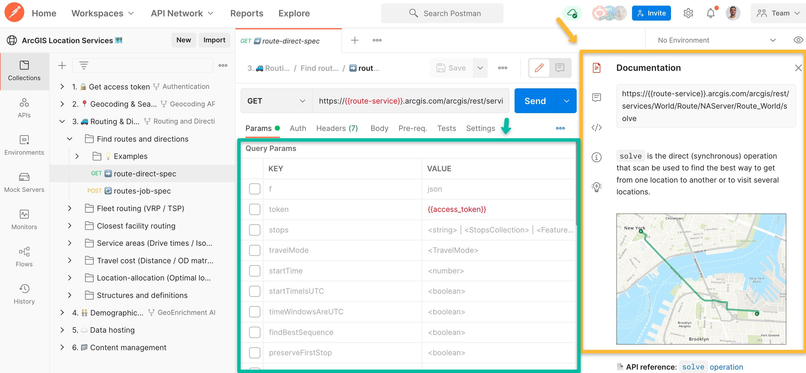

In addition to the query parameters, some requests also uses path variables. These can be identified because they uses a "colon" as a prefix (`:variableName`) as you can see in the following images:

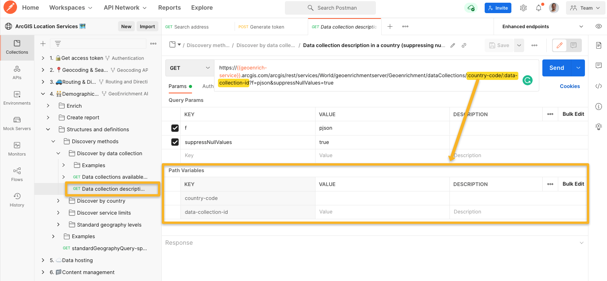

#### Examples folder

The structure of the directory depends on whether or not it supports async/jon requests or not:

* **If it only support sync/direct requests (➡️)**: the folder will include some examples requests directly within the folder.
* **If it supports sync/direct (➡️) but also async/job requests (🔄)**: the folder will contain folders for each type of request. The async/job will contain several numered requests (with a ✅) illustrating the usual workflow.

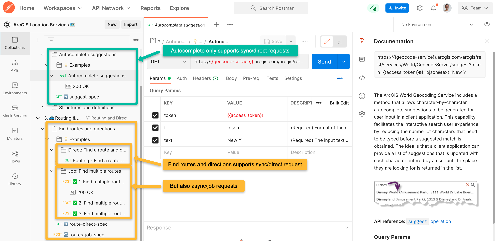

As you can notice, each example request includes a sample response:

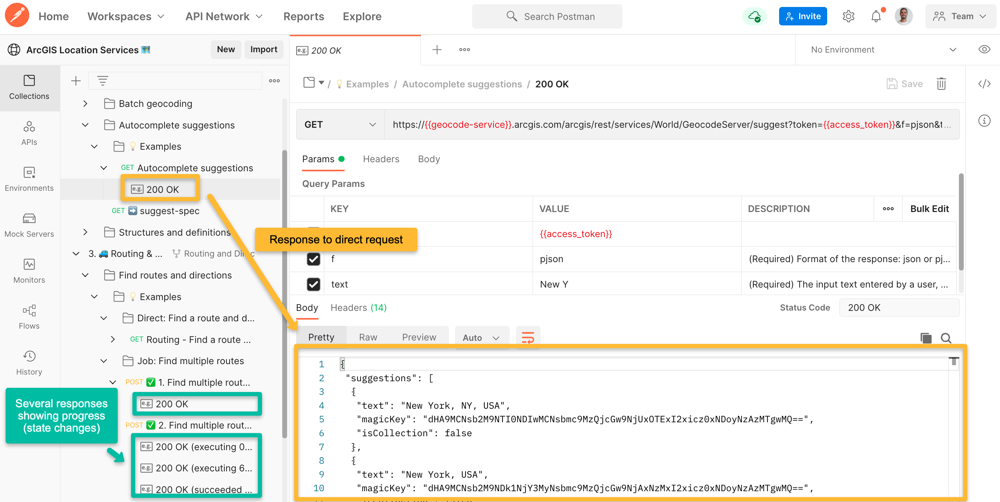
 
Another thing to note, is that to facilitate the execution of the asynchronous example requests, a code has been included in the "Test" tab which, after receiving the response that initiates the task (`submitJob`), it sets the `job_id` in the environment variables to allow the concatenation of the following requests:

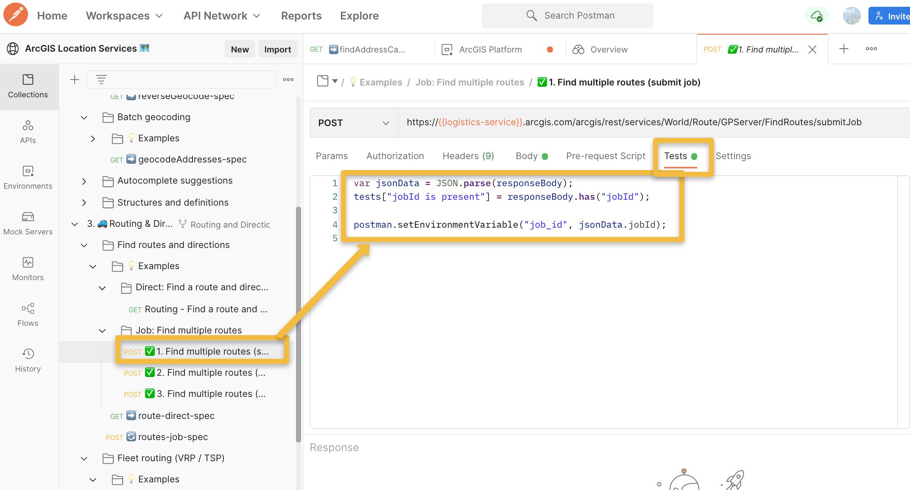

#### Response visualization (BETA)

When using the Postman native app, some requests will include a visualization of the results, like shown in this direct geocoding request:

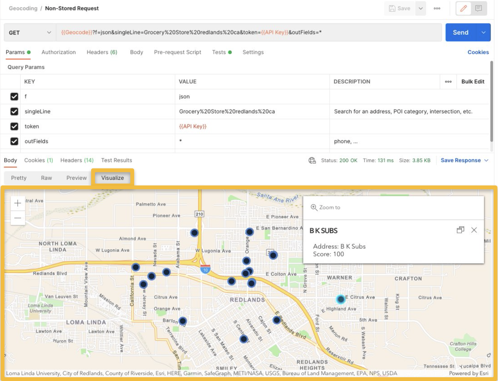

### Structures and definitions folder

And as mentioned before, in this folder we can find some useful requests that might be referenced from the other requests:

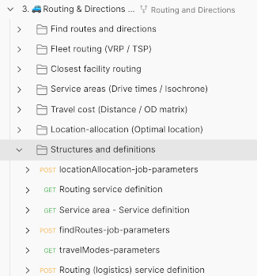